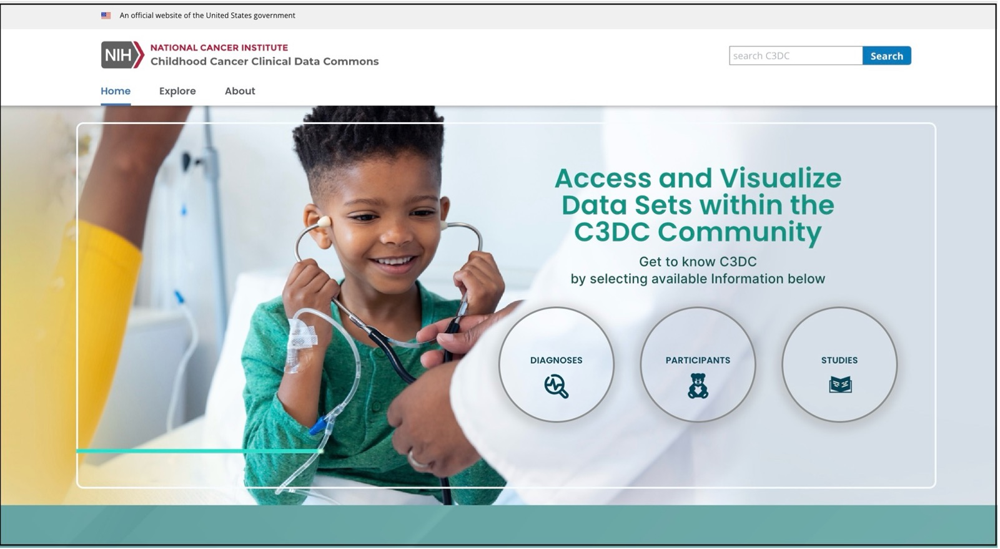
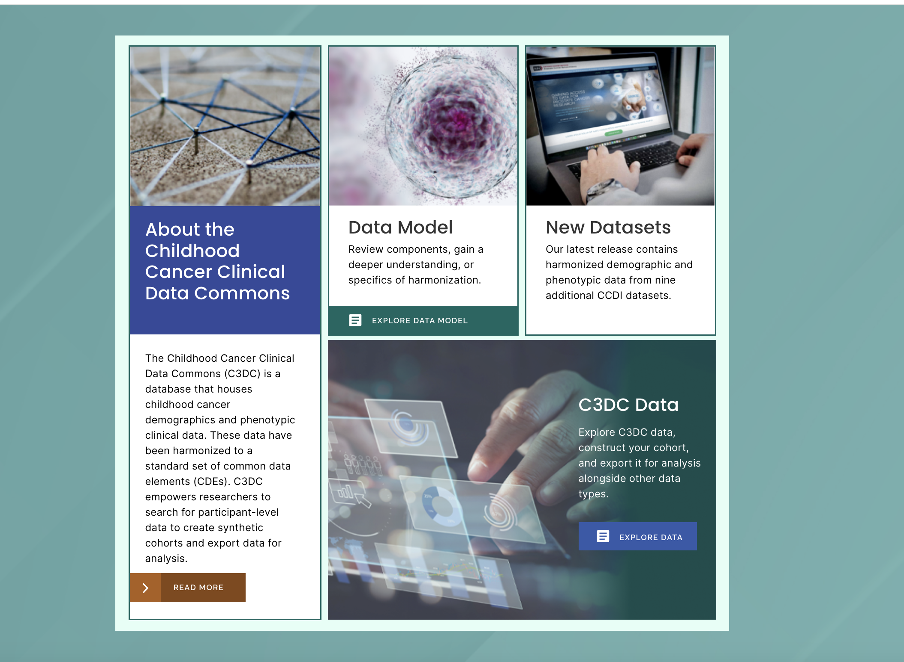
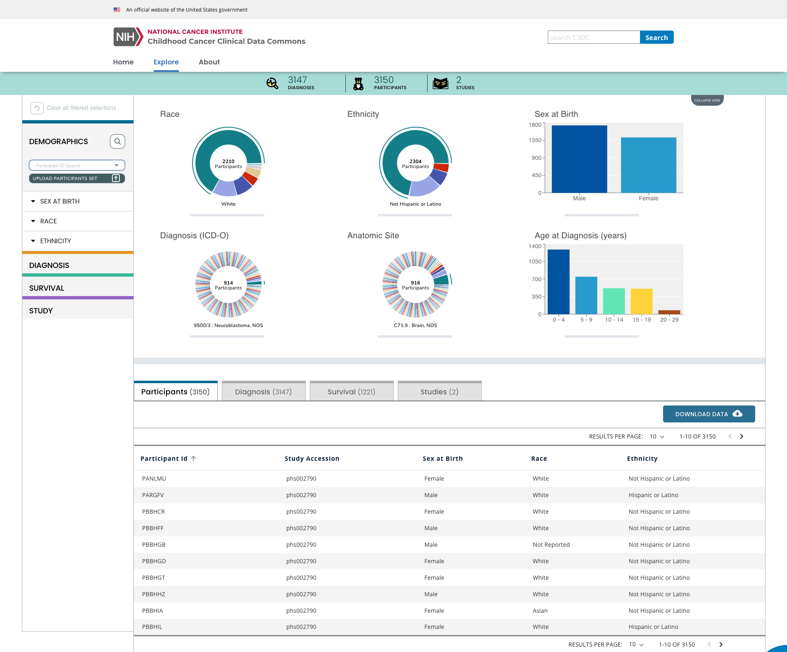
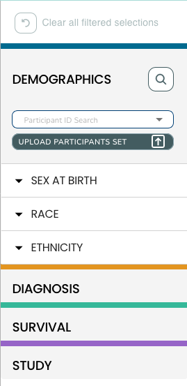
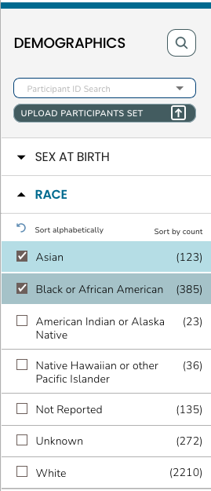
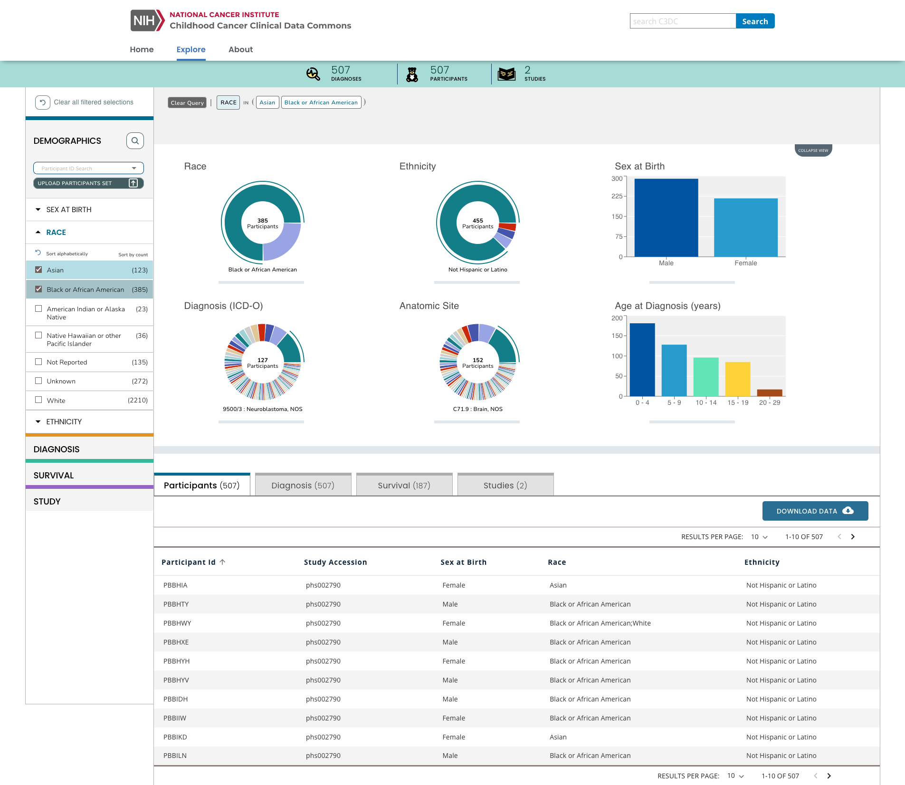
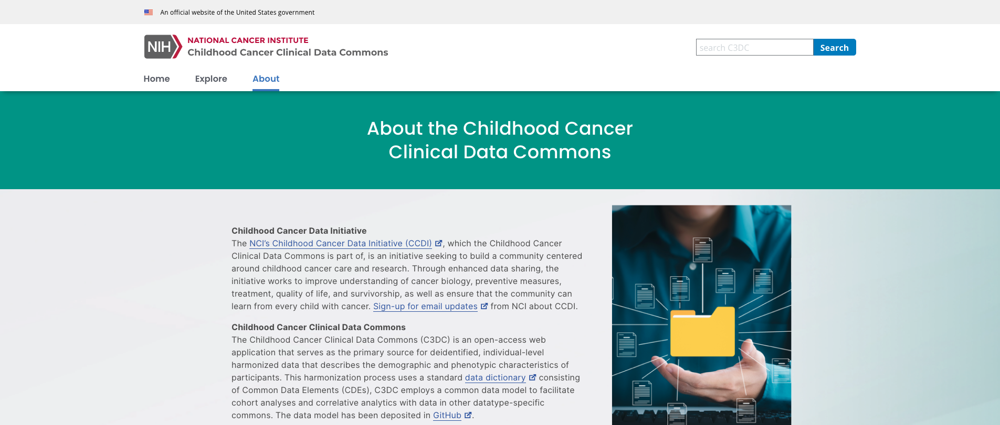

# The Childhood Cancer Clinical Data Commons (C3DC) 
 User Guide
 
 Version 2.0.0

## Version

| Date       | Description       | Author    |
|------------|-------------------|-----------|
| 05/01/2024 | Release 2   | C3DC Team |

## Table of Contents

- [The Childhood Cancer Clinical Data Commons (C3DC)](#the-childhood-cancer-clinical-data-commons-c3dc)
  - [Version](#version)
  - [Table of Contents](#table-of-contents)
  - [Introduction and Overview](#introduction-and-overview)
  - [C3DC Home Page](#c3dc-home-page)
  - [C3DC Explore Page](#c3dc-explore-page)
    - [Faceted Searching](#faceted-searching)
    - [Charts and Tables](#charts-and-tables)
  - [C3DC About Page](#c3dc-about-page)

## Introduction and Overview

The Childhood Cancer Clinical Data Commons (C3DC) enables searching demographic and phenotypic clinical data of childhood cancers. These data have been harmonized to a standard set of common data elements (CDEs). C3DC empowers researchers to search for participant-level data to create synthetic cohorts and export data for analysis.

This document describes a high-level overview of the features of C3DC. Investigators are encouraged to explore C3DC for themselves, using this guide as a primer.

## C3DC Home Page

The C3DC Home page allows users users to navigate to pages such as Explore and the About pages.

 

Additionally, at the bottom of the Home page, there are link-outs to brief descriptions of key sections of the C3DC website. 

 

## C3DC Explore Page 

Users can navigate to the Explore Page by clicking the link on the Home Page menu bar, which shows various sections for exploring the data. 

 

### Faceted Searching
On the Explore Page, users can select a subset of the childhood cancer participants by choosing their filtering option from the drop-down lists within four main categories: Demographics, Diagnoses, Survival, and Study. 

### Charts and Tables
The faceted search results are automatically updated in the Stats bar, the Visualization and Table sections.

## C3DC About Page 

Users can navigate to the About Page by clicking the link on the Home Page menu bar where you will find more information about the content of C3DC. This includes details such as dataset and data model information, as well as links to useful resources.

